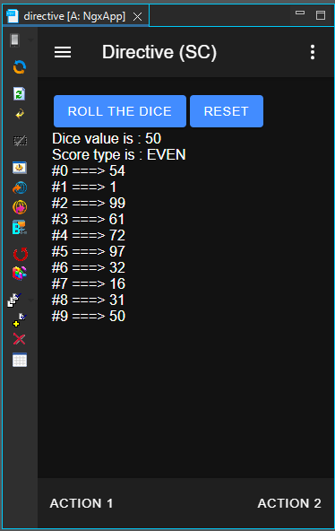

#  directive

How to use Directive

<i>Connectors</i>
<blockquote>

##  void

void connector, replace or don't use it

<i>Transactions</i>
<blockquote>

###  void

does nothing

</blockquote>

</blockquote>

<i>Sequences</i>
<blockquote>

<b>reset_values</b> : Removes values from Session
<blockquote>

##  reset_values

Removes values from Session.

</blockquote>

<b>roll_dice</b> : Generates a random value, says if it is even or not and saves values in Session
<blockquote>

##  roll_dice

Generates a random value, says if it is even or not and saves values in Session.

Variables

<table>
<tr>
<th>
name
</th>
<th>
comment
</th>
</tr>
<tr>
<td>
&nbsp;max
</td>
<td>

</td>
</tr>
<tr>
<td>
&nbsp;min
</td>
<td>

</td>
</tr>
</table>

</blockquote>

</blockquote>

<i>Mobile Application</i>
<blockquote>

##  Application

<ul>
<li>IF, SWITCH and FOREACH usage of the Directive component.</li>
</ul>
 

<i>Pages</i>
<blockquote>

<b>Page_SC</b> : Directive usage where data come from a Sequence (SC)
<blockquote>

###  Page_SC

Directive usage where data come from a Sequence (SC).

</blockquote>

<b>Page_TS</b> : Directive usage where data come from a CustomAction (TS)
<blockquote>

###  Page_TS

Directive usage where data come from a CustomAction (TS).

</blockquote>

</blockquote>

</blockquote>

